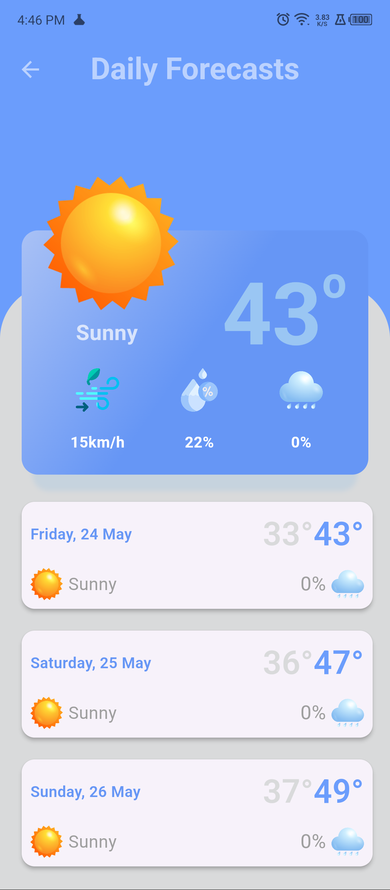

# weather_app

## Weather App | Flutter, Dart, Weather API 
Created a weather application that displays current weather information for the user’s location and selected cities.
• Integrated a weather API to fetch real-time weather data.
• Added features for hourly and daily weather forecasts, and settings for theme mode and notifications.
• Used Shared Preferences package to track user activity such as theme mode.

## Screenshots

<table>
    <thead>
        <tr>
            <td>Homepage</td>
<td>More Details Page</td>
<td>Settings Page</td>
<td>Search Page</td>
        </tr>
    </thead>
  <tr>
    <td></td>
    <td></td>
    <td></td>
    <td></td>
  </tr>
<thead>
        <tr>
            <td>Dark Mode</td>
<td>Dark Mode</td>
<td>Dark Mode</td>
<td>Dark Mode</td>
        </tr>
    </thead>
  <tr>
    <td></td>
    <td></td>
    <td></td>
    <td></td>
  </tr>
</table>

## Features

- Current Weather
- Current Location
- Dark Mode Theme
- Push Notification
